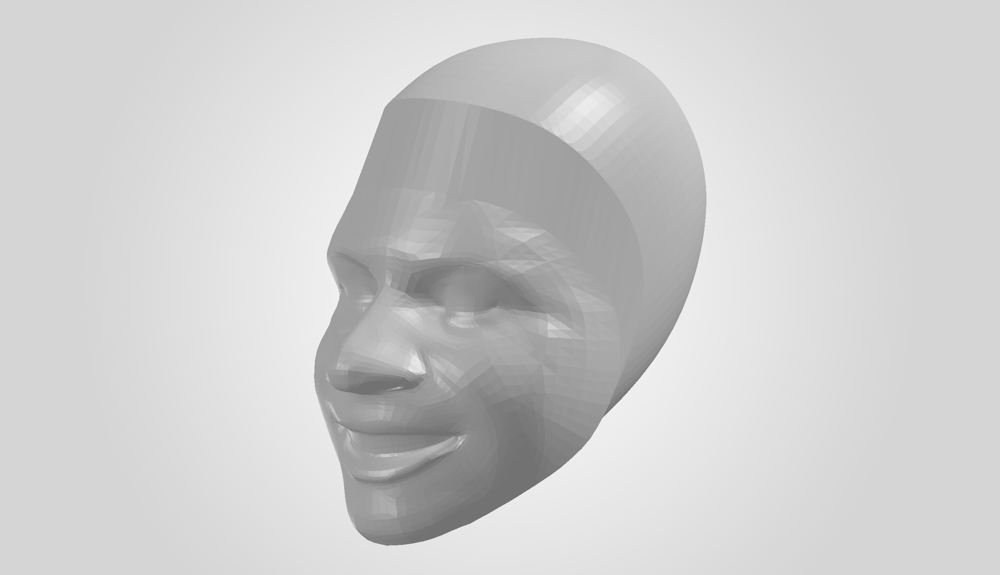

# 01. Image to STL

Convert a frontal face image into a metric-scaled, watertight 3D STL geometry for CFD preprocessing.

```text
2D face image → 3D head geometry → STL
```

## Input / Output

The default data directories are managed by the repository-level `project_paths.py`.

```text
Input : ai-cfd-data/01_images/face_XXXX.jpg
Output: ai-cfd-data/02_stl/face_XXXX.stl
```

Supported image formats:

```text
.jpg / .jpeg / .png
```

If `--input` is omitted, the script processes all supported images found in `ai-cfd-data/01_images`.

## Example

<table>
<tr>
<th>Input image</th>
<th>Generated STL — front view</th>
</tr>
<tr>
<td align="center"></td>
<td align="center"></td>
</tr>
</table>

A second view is included to make the reconstructed head depth easier to inspect.

<p align="center">
  
</p>

Actual generated geometry: [`image_to_stl_example_output.stl`](./image_to_stl_example_output.stl)

`image_to_stl_example_output.SLDPRT` is a SolidWorks import used only to produce the preview images; it is not an output required by the pipeline.

## Method

### 1. Face Landmark Detection

The script uses **MediaPipe Face Mesh** with `refine_landmarks=True` to detect one face. The 468 base facial landmarks are used for the face geometry, while the additional iris landmarks are used for scale estimation.

### 2. Iris-Based Metric Scaling

MediaPipe landmarks are initially expressed in image-relative coordinates, so the reconstructed geometry does not directly have a physical length scale.

The script estimates a metric scale from the detected irises:

- the left and right iris diameters are measured in image pixels,
- their mean diameter is mapped to a reference iris diameter of **11.7 mm**,
- the resulting `mm/pixel` scale is applied uniformly to the reconstructed coordinates,
- and an image is rejected if the left/right iris measurements differ by more than the allowed mismatch threshold.

The default maximum iris mismatch is **25%**.

### 3. Front-Face Mesh Construction

The 468 facial landmarks are connected using the facial mesh topology to construct the front-face triangular mesh.

### 4. Mesh Refinement and Smoothing

The front-face mesh is refined before the back-head geometry is added.

Default settings:

```text
Subdivision resolution : 3
HC Laplacian iterations: 10
```

These parameters can be changed from the command line.

### 5. Back-Head Reconstruction

The facial landmarks describe only the visible face region, so they do not form a closed head geometry by themselves.

A synthetic back-head region is therefore reconstructed using a ring-based geometry and connected to the facial mesh. This produces a closed head-shaped mesh suitable for the next CFD preprocessing stage.

### 6. STL Validation and Export

Before export, the coordinate orientation is converted to the geometry convention used by the downstream pipeline.

The final mesh is then validated with `trimesh`. The STL is saved only when it satisfies all of the following conditions:

- watertight mesh,
- consistent face winding,
- valid closed volume.

If any of these checks fails, the script reports the failure instead of silently saving an invalid geometry.

## Key Implementation Details

### Iris-Based Metric Scale

A fixed face-height normalization is not used. Instead, each image receives its own metric scale from the detected iris size. This preserves image-to-image geometric size variation while keeping one consistent scaling method across the dataset.

### Geometry Validation for CFD

The goal of this stage is not only to create a visually recognizable face mesh. The generated geometry must also be usable by the downstream SpaceClaim and Fluent workflow.

For that reason, watertightness, winding consistency, and closed-volume validity are checked before the STL is accepted.

## Usage

Run from the repository root.

Process all supported images in the default image directory:

```powershell
python .\01_image_to_stl\image_to_stl.py
```

Process a single image:

```powershell
python .\01_image_to_stl\image_to_stl.py --input face_0001.jpg
```

Available options:

| Option | Default | Description |
|---|---:|---|
| `--input` | — | Process one image instead of the full image directory |
| `--resolution` | `3` | Triangle subdivision resolution |
| `--iterations` | `10` | HC Laplacian smoothing iterations |
| `--iris-diameter-mm` | `11.7` | Reference iris diameter used for metric scaling |
| `--max-iris-mismatch` | `0.25` | Maximum relative left/right iris diameter mismatch |

## Output Validation

For each successfully processed image, the script reports:

```text
Iris scale
Metric scale [mm/pixel]
Estimated face width / height
Watertight status
Winding consistency
Valid volume
Mesh volume
```

A successful conversion produces the corresponding STL with the same base filename:

```text
face_0001.jpg
    ↓
face_0001.stl
```

## Pipeline Position

```text
Face image
    ↓
01_image_to_stl
    ↓
Watertight STL
    ↓
02_spaceclaim
```
