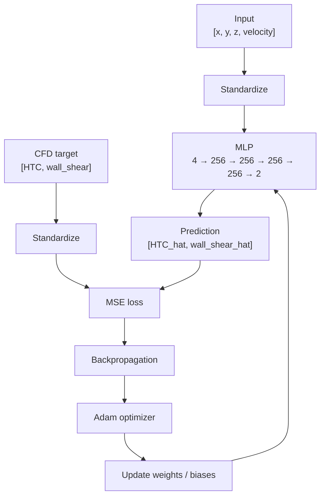
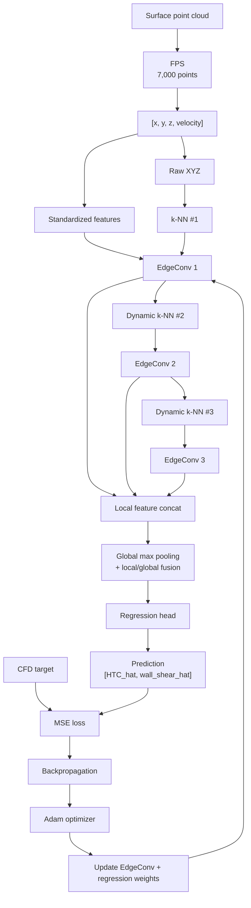

# Model Training and Evaluation

This directory contains the neural-network training and evaluation stage of the AI-CFD pipeline.

Two surrogate models are implemented:

- **Point-wise MLP**
- **DGCNN (Dynamic Graph CNN)**

Both models learn the CFD mappings

```text
HTC        = f([x, y, z, velocity])
wall_shear = g([x, y, z, velocity])
```

by approximating them with neural networks:

```text
HTC_hat        = f_hat([x, y, z, velocity])
wall_shear_hat = g_hat([x, y, z, velocity])
```

The two models solve the same regression problem but use different representations of surface geometry.

---

## 1. Prediction Task

For every surface point:

```text
Input  : [x, y, z, velocity]
Target : [HTC, wall_shear]
```

- `x, y, z`: surface coordinates in meters
- `velocity`: inlet velocity in m/s
- `HTC`: heat-transfer coefficient
- `wall_shear`: wall-shear-stress magnitude

Only these four variables are used as model inputs.

### Dataset split

```text
100 face geometries
× 3 inlet velocities (5, 8, 10 m/s)
= 300 CFD cases
```

| Split | Face IDs | Cases |
|---|---|---:|
| Train | `face_0001` – `face_0080` | 240 |
| Validation | `face_0081` – `face_0090` | 30 |
| Test | `face_0091` – `face_0100` | 30 |

All velocity cases from the same face remain in the same split.

### Common training setup

Both models use:

```text
Standardization
→ Forward pass
→ MSE loss
→ Backpropagation
→ Adam optimizer
→ Validation
→ Best-checkpoint selection
→ Held-out test evaluation
```

Standardization is fitted using **training data only**:

```text
normalized = (value - mean) / std
```

Final metrics are calculated after inverse transformation:

```text
MAE, RMSE, R²
```

---

# 2. Point-wise MLP

## 2.1 Model

The MLP approximates the target functions independently at each point:

```text
HTC_hat_i
= f_hat_MLP([x_i, y_i, z_i, velocity])

wall_shear_hat_i
= g_hat_MLP([x_i, y_i, z_i, velocity])
```

No explicit neighboring-point information is used.

### Architecture

```text
[x, y, z, velocity]
        ↓
4 → 256 → 256 → 256 → 256 → 2
        ↓
[HTC_hat, wall_shear_hat]
```

ReLU is applied after each hidden layer.

```text
Trainable parameters: 199,170
```

### Training data

The MLP uses all CFD wall points in each split.

```text
Train      : 1,960,554 points
Validation :   250,695 points
Test       :   244,296 points
```

```text
X: (N, 4)
Y: (N, 2)
```

---

## 2.2 Weight Update



```text
Loss = mean((prediction - target)^2)
```

The Linear-layer weights and biases are updated through backpropagation and Adam.

---

## 2.3 Training Configuration

```text
Optimizer       : Adam
Loss            : MSE
Batch size      : 8192
Learning rate   : 1e-3
Weight decay    : 0
Maximum epochs  : 100
Early stopping  : patience = 15
Random seed     : 42
```

```text
Environment      : Google Colab / Tesla T4
PyTorch          : 2.11.0+cu128
Best epoch       : 6
Best val loss    : 0.17470113
Stopped at epoch : 21
Training runtime : 9.1 min
```

Best model:

```text
weights/mlp/best_model.pt
```

---

# 3. DGCNN

## 3.1 Model

DGCNN predicts the same HTC and wall-shear targets, but each CFD case is represented as a **surface point cloud**.

For each point, the prediction can use:

```text
point information
+
local neighborhood information
+
global surface information
```

Each sample contains:

```text
7,000 points
Input  : (7000, 4)
Target : (7000, 2)
```

---

## 3.2 Farthest Point Sampling

A fixed 7,000-point cloud is generated for each CFD case using deterministic Farthest Point Sampling (FPS).

```text
1. Start from the point farthest from the point-cloud centroid.
2. Repeatedly select the point farthest from its nearest selected point.
3. Stop after 7,000 points.
```

The selected row indices are stored in:

```text
04_cfd_dataset/fps_indices_7000.npz
```

---

## 3.3 EdgeConv and Dynamic Graph

The core DGCNN operation is EdgeConv.

For center point `i` and neighbor `j`:

```text
edge feature = [f_i, f_j - f_i]
```

This combines the center-point feature with the relative feature of a neighbor.

```text
center + k neighbors
        ↓
[f_i, f_j - f_i]
        ↓
shared Linear + ReLU
        ↓
max over neighbors
        ↓
updated point feature
```

The model uses:

```text
k = 20
k-NN chunk size = 1024
```

### First graph

The first k-NN graph is constructed using **raw physical XYZ coordinates**:

```text
first k-NN space = raw_xyz
```

The EdgeConv feature values use standardized:

```text
[x, y, z, velocity]
```

### Later graphs

The second and third graphs are rebuilt from learned point features:

```text
raw XYZ
  ↓
k-NN #1
  ↓
EdgeConv 1
  ↓
learned features
  ↓
k-NN #2
  ↓
EdgeConv 2
  ↓
learned features
  ↓
k-NN #3
  ↓
EdgeConv 3
```

This dynamic graph reconstruction allows neighborhood relationships to evolve with the learned representation.

---

## 3.4 Architecture

```text
Input (B, N, 4)
        │
        ├── EdgeConv 1: 4  → 64
        ├── EdgeConv 2: 64 → 64
        └── EdgeConv 3: 64 → 128
                    │
                    ↓
        Local feature concatenation
          64 + 64 + 128 = 256
                    │
          ┌─────────┴─────────┐
          │                   │
      Local 256       Global max pooling
                              ↓
                         Global 256
          │                   │
          └─────────┬─────────┘
                    ↓
             Local + Global
               256 + 256
                  = 512
                    ↓
            Regression head
          512 → 256 → 128 → 2
                    ↓
         [HTC_hat, wall_shear_hat]
```

```text
Trainable parameters: 189,826
```

Global max pooling provides one 256-dimensional descriptor of the complete surface, which is combined with the 256-dimensional local feature for each point.

---

## 3.5 Forward and Weight Update



The loss is:

```text
Loss = mean((prediction - target)^2)
```

Trainable parameters are the Linear weights and biases in:

```text
EdgeConv layers
Regression head
```

FPS indices and k-NN neighbor indices are not trainable.  
However, later dynamic graphs can change after weight updates because the learned point features change.

---

## 3.6 Training Configuration

```text
Train      : 240 cases × 7,000 points
Validation :  30 cases × 7,000 points
Test       :  30 cases × 7,000 points
```

```text
Optimizer       : Adam
Loss            : MSE
Batch size      : 16
Learning rate   : 1e-3
Weight decay    : 0
Maximum epochs  : 100
Early stopping  : patience = 15
Random seed     : 42

k               : 20
k-NN chunk size : 1024
Points / sample : 7000
First kNN space : raw_xyz
```

```text
Environment      : Google Colab / Tesla T4
PyTorch          : 2.11.0+cu128
Best epoch       : 96
Best val loss    : 0.05088102
Completed epochs : 100
Training runtime : 26.2 min
```

Best model:

```text
weights/dgcnn/best_model.pt
```

---

# 4. MLP vs DGCNN

Both models approximate the same target mappings:

```text
HTC        = f([x, y, z, velocity])
wall_shear = g([x, y, z, velocity])
```

but differ in how geometry is represented.

```text
MLP
[x_i, y_i, z_i, velocity]
        ↓
point-wise regression
        ↓
[HTC_hat_i, wall_shear_hat_i]
```

```text
DGCNN
surface point cloud
        ↓
dynamic local neighborhoods
        ↓
local + global geometric features
        ↓
[HTC_hat_i, wall_shear_hat_i]
```

Both use MSE loss, backpropagation, and Adam.  
The main difference is therefore the geometric information available before the final regression.

### Model capacity

| Model | Trainable parameters |
|---|---:|
| Point-wise MLP | 199,170 |
| DGCNN | 189,826 |

The parameter counts were kept close to reduce model-capacity differences in the comparison.

The MLP uses all wall points, while the DGCNN uses 7,000 FPS-selected points per case, so this is a project-level comparison rather than a strict architecture-only ablation.

---

# 5. Held-out Test Results

The test split contains `face_0091` – `face_0100` at 5, 8, and 10 m/s.

| Model | HTC MAE | HTC RMSE | HTC R² | Wall-shear MAE | Wall-shear RMSE | Wall-shear R² |
|---|---:|---:|---:|---:|---:|---:|
| Point-wise MLP | 7.984080 | 12.006493 | 0.814444 | 0.068493 | 0.129388 | 0.839066 |
| DGCNN | **5.177561** | **7.392631** | **0.925621** | **0.040289** | **0.066564** | **0.957276** |

Evaluation sizes:

```text
MLP   : 30 cases / 244,296 wall points
DGCNN : 30 cases / 210,000 points
```

Full logs:

```text
results/mlp/test_evaluation.txt
results/dgcnn/test_evaluation.txt
```

Under this dataset and face-level split, the geometry-aware DGCNN achieved lower error and higher R² for both target quantities.

---

# 6. Files and Artifacts

```text
05_model_training/
├── common/
│   ├── metrics.py
│   └── scalers.py
├── mlp/
│   ├── model.py
│   ├── train.py
│   └── evaluate.py
├── dgcnn/
│   ├── model.py
│   ├── train.py
│   └── evaluate.py
├── notebooks/
│   ├── ai_cfd_mlp_colab.ipynb
│   └── ai_cfd_dgcnn_colab.ipynb
├── results/
│   ├── mlp/test_evaluation.txt
│   └── dgcnn/test_evaluation.txt
└── weights/
    ├── mlp/
    │   ├── best_model.pt
    │   ├── last_checkpoint.pt
    │   └── scalers.npz
    └── dgcnn/
        ├── best_model.pt
        ├── last_checkpoint.pt
        └── scalers.npz
```

Each model stores:

- `best_model.pt` — best-validation model used for test evaluation
- `last_checkpoint.pt` — latest training state for resume
- `scalers.npz` — training-fitted standardization statistics

The executed Colab notebooks contain the final GPU training and evaluation workflows.

---

# 7. Running the Code

Run from the repository root:

```bash
# MLP
python 05_model_training/mlp/model.py
python 05_model_training/mlp/train.py
python 05_model_training/mlp/evaluate.py

# DGCNN preprocessing
python 04_cfd_dataset/preprocessing_dgcnn.py

# DGCNN
python 05_model_training/dgcnn/model.py
python 05_model_training/dgcnn/train.py
python 05_model_training/dgcnn/evaluate.py
```

---

# 8. Summary

The model-training stage approximates:

```text
HTC        = f([x, y, z, velocity])
wall_shear = g([x, y, z, velocity])
```

with two neural-network approaches.

```text
Point-wise MLP
Parameters      : 199,170
HTC R²          : 0.814444
Wall shear R²   : 0.839066
```

```text
DGCNN
Parameters      : 189,826
HTC R²          : 0.925621
Wall shear R²   : 0.957276
```

The MLP performs independent point-wise regression.

The DGCNN predicts the same quantities while explicitly incorporating local neighborhood and whole-surface geometric information.

For the held-out facial geometries used in this project, the DGCNN produced the more accurate surrogate predictions.
