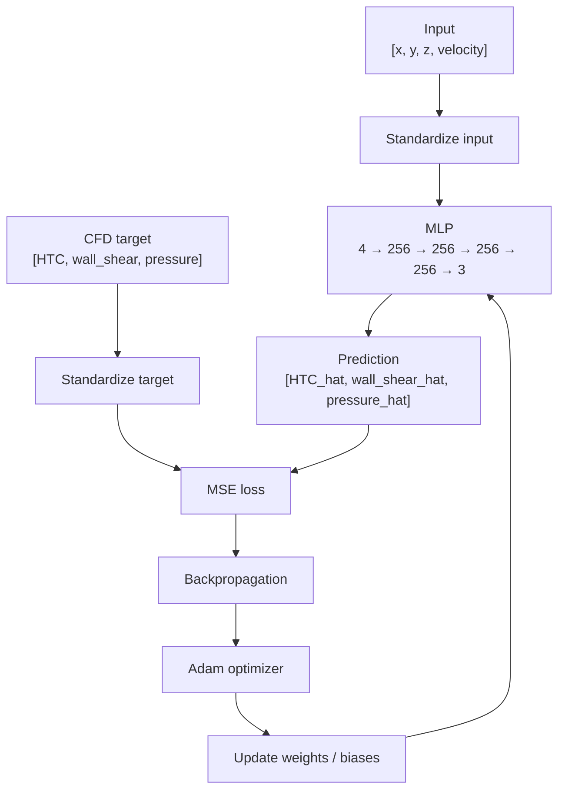
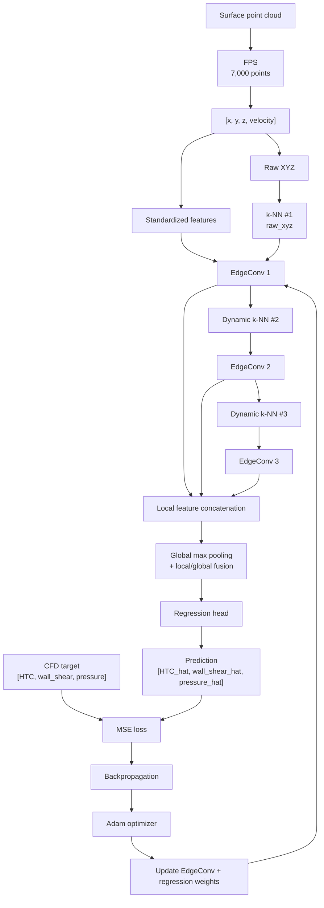

# Model Training and Evaluation

This directory contains the neural-network training and held-out evaluation stage of the AI-CFD pipeline.

Two surrogate models are implemented:

- **Point-wise MLP**
- **DGCNN (Dynamic Graph CNN)**

Both models predict three CFD quantities from facial-surface position and inlet velocity:

```text
Input  : [x, y, z, velocity]
Target : [HTC, wall_shear, pressure]
```

The two models solve the same regression problem but differ in how they represent surface geometry.

---

## 1. Prediction Task

For each surface point, the surrogate model learns

```text
[HTC, wall_shear, pressure]
=
F([x, y, z, velocity])
```

and approximates it as

```text
[HTC_hat, wall_shear_hat, pressure_hat]
=
F_hat([x, y, z, velocity])
```

where:

- `x, y, z` are surface coordinates in meters,
- `velocity` is inlet velocity in m/s,
- `HTC` is the heat-transfer coefficient,
- `wall_shear` is the Fluent wall-shear quantity in Pa,
- `pressure` is the Fluent pressure in Pa.

Only `[x, y, z, velocity]` are used as model inputs.

### Dataset split

The CFD dataset contains:

```text
100 face geometries
× 3 inlet velocities (5, 8, 10 m/s)
= 300 CFD cases
```

| Split | Face IDs | Cases |
|---|---|---:|
| Train | `face_0001` – `face_0080` | 240 |
| Validation | `face_0081` – `face_0090` | 30 |
| Test | `face_0091` – `face_0100` | 30 |

All velocity cases from the same face remain in the same split, so the held-out test set contains geometries not used during training or validation.

### Common training procedure

Both models use the same overall regression workflow:

```text
Training-only standardization
→ Forward pass
→ MSE loss
→ Backpropagation
→ Adam optimizer
→ Validation
→ Best-checkpoint selection
→ Held-out test evaluation
```

Standardization is fitted using **training data only**:

```text
normalized = (value - mean) / std
```

Both the four input variables and the three target variables are standardized.

Final test metrics are calculated after transforming predictions back to physical units:

```text
MAE
RMSE
R²
```

---

# 2. Point-wise MLP

## 2.1 Model

The MLP performs independent regression at each surface point:

```text
[HTC_hat_i, wall_shear_hat_i, pressure_hat_i]
=
F_hat_MLP([x_i, y_i, z_i, velocity])
```

No explicit neighboring-point information is provided to the model.

### Architecture

```text
[x, y, z, velocity]
        ↓
4 → 256 → 256 → 256 → 256 → 3
        ↓
[HTC_hat, wall_shear_hat, pressure_hat]
```

ReLU is applied after each hidden layer.

```text
Trainable parameters: 199,427
```

### Training data

The MLP uses all CFD wall points in each split.

```text
Train      : 1,960,554 points
Validation :   250,695 points
Test       :   244,296 points
```

Array shapes:

```text
X: (N, 4)
Y: (N, 3)
```

---

## 2.2 Weight Update



The optimization objective is:

```text
Loss = mean((prediction - target)^2)
```

Trainable Linear-layer weights and biases are updated through backpropagation and Adam.

---

## 2.3 Training Configuration

```text
Optimizer       : Adam
Loss            : MSE
Batch size      : 8192
Learning rate   : 1e-3
Weight decay    : 0
Maximum epochs  : 100
Early stopping  : patience = 15
Random seed     : 42
```

Final training result:

```text
Environment      : Google Colab / Tesla T4
PyTorch          : 2.11.0+cu128
Best epoch       : 33
Best val loss    : 0.12895100
Stopped at epoch : 48
```

The best validation model is stored at:

```text
weights/mlp/best_model.pt
```

The latest training state is stored at:

```text
weights/mlp/last_checkpoint.pt
```

---

# 3. DGCNN

## 3.1 Model

DGCNN predicts the same three targets, but represents each CFD case as a surface point cloud.

For each point, the model can combine:

```text
point information
+
local neighborhood information
+
global surface information
```

Each case contains:

```text
7,000 points
Input  : (7000, 4)
Target : (7000, 3)
```

---

## 3.2 Farthest Point Sampling

A fixed 7,000-point cloud is generated for each CFD case using deterministic Farthest Point Sampling (FPS).

```text
1. Start from the point farthest from the point-cloud centroid.
2. Repeatedly select the point farthest from its nearest selected point.
3. Stop after 7,000 points.
```

The selected row indices are stored in:

```text
04_cfd_dataset/fps_indices_7000.npz
```

The same selected CFD rows provide all three target values:

```text
[HTC, wall_shear, pressure]
```

---

## 3.3 EdgeConv and Dynamic Graph

The core DGCNN operation is EdgeConv.

For center point `i` and neighboring point `j`:

```text
edge feature = [f_i, f_j - f_i]
```

The neighbor features are processed with a shared Linear layer and ReLU, followed by max aggregation over the `k` neighbors:

```text
center + k neighbors
        ↓
[f_i, f_j - f_i]
        ↓
shared Linear + ReLU
        ↓
max over neighbors
        ↓
updated point feature
```

The final model uses:

```text
k = 20
k-NN chunk size = 1024
```

### First graph

The first k-NN graph is constructed using **raw physical XYZ coordinates**:

```text
first k-NN space = raw_xyz
```

This preserves physical geometric proximity for the first neighborhood graph.

The EdgeConv feature values themselves use standardized:

```text
[x, y, z, velocity]
```

### Later graphs

The second and third neighborhood graphs are reconstructed from learned point features:

```text
raw XYZ
  ↓
k-NN #1
  ↓
EdgeConv 1
  ↓
learned features
  ↓
dynamic k-NN #2
  ↓
EdgeConv 2
  ↓
learned features
  ↓
dynamic k-NN #3
  ↓
EdgeConv 3
```

This allows neighborhood relationships to evolve as the learned feature representation changes.

---

## 3.4 Architecture

```text
Input (B, N, 4)
        │
        ├── EdgeConv 1: 4  → 64
        ├── EdgeConv 2: 64 → 64
        └── EdgeConv 3: 64 → 128
                    │
                    ↓
         Local feature concatenation
           64 + 64 + 128 = 256
                    │
           ┌────────┴────────┐
           │                 │
       Local 256       Global max pooling
                              ↓
                         Global 256
           │                 │
           └────────┬────────┘
                    ↓
              Local + Global
                256 + 256
                  = 512
                    ↓
             Regression head
           512 → 256 → 128 → 3
                    ↓
 [HTC_hat, wall_shear_hat, pressure_hat]
```

```text
Trainable parameters: 189,955
```

Global max pooling produces a 256-dimensional descriptor of the complete surface. This descriptor is concatenated with the 256-dimensional local feature at every point before the regression head.

---

## 3.5 Forward Pass and Weight Update



The training loss is:

```text
Loss = mean((prediction - target)^2)
```

Trainable parameters are the Linear weights and biases in:

```text
EdgeConv layers
Regression head
```

FPS indices and k-NN neighbor indices are not trainable.

However, later dynamic graphs can change after weight updates because they are reconstructed from learned point features.

---

## 3.6 Training Configuration

Dataset sizes:

```text
Train      : 240 cases × 7,000 points
Validation :  30 cases × 7,000 points
Test       :  30 cases × 7,000 points
```

Training settings:

```text
Optimizer       : Adam
Loss            : MSE
Batch size      : 16
Learning rate   : 1e-3
Weight decay    : 0
Maximum epochs  : 100
Early stopping  : patience = 15
Random seed     : 42

k               : 20
k-NN chunk size : 1024
Points / sample : 7000
First kNN space : raw_xyz
```

Final training result:

```text
Environment      : Google Colab / Tesla T4
PyTorch          : 2.11.0+cu128
Best epoch       : 98
Best val loss    : 0.04454750
Completed epochs : 100
```

The best validation model is stored at:

```text
weights/dgcnn/best_model.pt
```

The latest training state is stored at:

```text
weights/dgcnn/last_checkpoint.pt
```

---

# 4. MLP vs DGCNN

Both models approximate the same three-target mapping:

```text
[HTC, wall_shear, pressure]
=
F([x, y, z, velocity])
```

but differ in the geometric information available to the regression model.

### Point-wise MLP

```text
[x_i, y_i, z_i, velocity]
        ↓
independent point-wise regression
        ↓
[HTC_hat_i, wall_shear_hat_i, pressure_hat_i]
```

### DGCNN

```text
surface point cloud
        ↓
dynamic local neighborhoods
        ↓
local + global geometric features
        ↓
[HTC_hat_i, wall_shear_hat_i, pressure_hat_i]
```

Both models use standardized targets, MSE loss, backpropagation, and Adam.

The principal modeling difference is therefore whether explicit local and global surface information is available before the final regression.

### Model capacity

| Model | Trainable parameters |
|---|---:|
| Point-wise MLP | 199,427 |
| DGCNN | 189,955 |

The parameter counts are of similar scale, reducing large model-capacity differences in the comparison.

However, the models do not receive identical point sets:

- the MLP uses all available CFD wall points,
- the DGCNN uses 7,000 deterministic FPS-selected points per case.

Therefore, the comparison should be interpreted as a **project-level surrogate-model comparison**, not as a strict architecture-only ablation.

---

# 5. Held-out Test Results

The held-out test set contains:

```text
face_0091 – face_0100
at 5, 8, and 10 m/s
```

No face geometry in this test set is used for training or validation.

## 5.1 Full metrics

| Model | Target | MAE | RMSE | R² |
|---|---|---:|---:|---:|
| Point-wise MLP | HTC | 7.847612 | 12.157173 | 0.809757 |
| Point-wise MLP | wall_shear | 0.065297 | 0.127328 | 0.844150 |
| Point-wise MLP | pressure | 3.928130 | 7.107886 | 0.944223 |
| DGCNN | HTC | **5.489491** | **7.681516** | **0.919694** |
| DGCNN | wall_shear | **0.040926** | **0.068306** | **0.955010** |
| DGCNN | pressure | **3.417522** | **5.796989** | **0.961108** |

## 5.2 Evaluation sizes

```text
MLP
Test cases  : 30
Test points : 244,296

DGCNN
Test cases    : 30
Points / case : 7,000
Test points   : 210,000
```

Full evaluation logs are stored at:

```text
results/mlp/test_evaluation.txt
results/dgcnn/test_evaluation.txt
```

Under this dataset and face-level split, the DGCNN achieved lower MAE/RMSE and higher R² for all three target quantities.

The result is consistent with the intended role of the DGCNN: incorporating neighborhood and whole-surface information that is unavailable to independent point-wise MLP regression.

---

# 6. Files and Artifacts

```text
05_model_training/
├── common/
│   ├── metrics.py
│   └── scalers.py
│
├── mlp/
│   ├── model.py
│   ├── train.py
│   └── evaluate.py
│
├── dgcnn/
│   ├── model.py
│   ├── train.py
│   └── evaluate.py
│
├── notebooks/
│   ├── ai_cfd_mlp_colab.ipynb
│   └── ai_cfd_dgcnn_colab.ipynb
│
├── results/
│   ├── mlp/
│   │   └── test_evaluation.txt
│   └── dgcnn/
│       └── test_evaluation.txt
│
└── weights/
    ├── mlp/
    │   ├── best_model.pt
    │   ├── last_checkpoint.pt
    │   └── scalers.npz
    │
    └── dgcnn/
        ├── best_model.pt
        ├── last_checkpoint.pt
        └── scalers.npz
```

Each model stores:

- `best_model.pt` — checkpoint with the lowest validation loss, used for held-out test evaluation,
- `last_checkpoint.pt` — latest training state for resume/recovery,
- `scalers.npz` — standardization statistics fitted from the training split only.

The Colab notebooks contain the executed GPU training and evaluation workflows.

---

# 7. Running the Code

Run from the repository root.

### MLP

```bash
python 05_model_training/mlp/model.py
python 05_model_training/mlp/train.py
python 05_model_training/mlp/evaluate.py
```

### DGCNN preprocessing

```bash
python 04_cfd_dataset/preprocessing_dgcnn.py
```

This generates the deterministic 7,000-point FPS indices required by the DGCNN dataset pipeline.

### DGCNN

```bash
python 05_model_training/dgcnn/model.py
python 05_model_training/dgcnn/train.py
python 05_model_training/dgcnn/evaluate.py
```

For the final GPU runs used in this repository, see:

```text
notebooks/ai_cfd_mlp_colab.ipynb
notebooks/ai_cfd_dgcnn_colab.ipynb
```

---

# 8. Summary

The model-training stage learns the three-target CFD surrogate mapping:

```text
[x, y, z, velocity]
        ↓
[HTC, wall_shear, pressure]
```

using two approaches.

### Point-wise MLP

```text
Architecture : 4 → 256 → 256 → 256 → 256 → 3
Parameters   : 199,427

HTC R²        : 0.809757
Wall shear R² : 0.844150
Pressure R²   : 0.944223
```

### DGCNN

```text
Regression head : 512 → 256 → 128 → 3
Parameters      : 189,955
Points / sample : 7,000
k               : 20

HTC R²          : 0.919694
Wall shear R²   : 0.955010
Pressure R²     : 0.961108
```

The MLP serves as a point-wise baseline using only each point's own position and inlet velocity.

The DGCNN additionally incorporates dynamic local neighborhoods and a whole-surface global feature.

For the held-out facial geometries in this project, the DGCNN produced the more accurate surrogate predictions for **HTC, wall shear, and pressure**.
