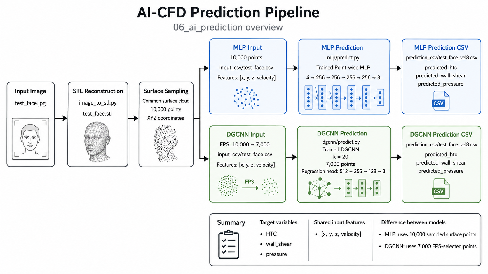

# AI Prediction

This directory contains the **inference stage** of the AI-CFD pipeline.

A new face image is converted into a reconstructed 3D surface, sampled into model-input point clouds, and passed through the trained **Point-wise MLP** and **DGCNN** models from `05_model_training`.

Both models predict three CFD quantities:

```text
HTC
wall shear
pressure
```

No new CFD simulation or model training is performed in this stage.

---

## 1. Pipeline



```text
JPG / PNG image
      ↓
image → STL
      ↓
STL surface sampling
      ↓
common surface cloud: 10,000 XYZ points
      ↓
      ├──────────────────────────────┐
      │                              │
      ↓                              ↓
MLP input                      DGCNN input
10,000 points                  FPS: 10,000 → 7,000
      │                              │
      └──── + inlet velocity ────────┘
                     ↓
             [x, y, z, velocity]
                     ↓
          trained MLP / DGCNN
                     ↓
      [HTC, wall shear, pressure]
                     ↓
              prediction CSV
```

The image-to-STL stage reuses the existing implementation in:

```text
01_image_to_stl/image_to_stl.py
```

The DGCNN branch also reuses the same farthest-point-sampling implementation used by the training dataset pipeline.

---

## 2. Directory Structure

```text
06_ai_prediction/
├── README.md
├── preprocess.py
├── mlp/
│   └── predict.py
├── dgcnn/
│   └── predict.py
└── assets/
    └── prediction_pipeline.png
```

Generated prediction data are stored outside the GitHub source tree:

```text
ai-cfd-data/07_predictions/
├── input_image/
├── stl/
├── mlp/
│   ├── input_csv/
│   └── prediction_csv/
└── dgcnn/
    ├── input_csv/
    └── prediction_csv/
```

---

## 3. Prediction Preprocessing

`preprocess.py` prepares a new face geometry for either model.

```text
input image
   ↓
reconstructed STL
   ↓
sample 10,000 surface points
   ↓
common XYZ surface cloud
   ├── MLP input: 10,000 points
   └── DGCNN input: FPS → 7,000 points
```

### Coordinate units

The reconstructed STL geometry is stored in millimeters.

Before model-input CSVs are written:

```text
STL coordinates
mm → m
```

The prediction models therefore receive coordinates in the same physical unit used during model training.

### Generated preprocessing CSV

Both model branches write:

```text
x,y,z
```

The inlet velocity is not stored during preprocessing. It is appended during prediction:

```text
[x, y, z] + velocity
→
[x, y, z, velocity]
```

### MLP preprocessing

The MLP receives the full common sampled surface:

```text
10,000 surface points
```

Output:

```text
ai-cfd-data/07_predictions/mlp/input_csv/<geometry>.csv
```

### DGCNN preprocessing

The DGCNN receives a fixed-size point cloud:

```text
common surface cloud
10,000 points
      ↓
Farthest Point Sampling
      ↓
7,000 points
```

Output:

```text
ai-cfd-data/07_predictions/dgcnn/input_csv/<geometry>.csv
```

The DGCNN input size must match the trained checkpoint:

```text
7,000 points / sample
```

### Run

From:

```text
github/06_ai_prediction/
```

Both model inputs:

```powershell
python preprocess.py --model both --input test_face.jpg
```

MLP only:

```powershell
python preprocess.py --model mlp --input test_face.jpg
```

DGCNN only:

```powershell
python preprocess.py --model dgcnn --input test_face.jpg
```

Force regeneration:

```powershell
python preprocess.py --model both --input test_face.jpg --overwrite
```

Without `--overwrite`, existing up-to-date outputs are skipped.

---

## 4. MLP Prediction

The Point-wise MLP performs independent regression at each sampled surface point.

### Input

```text
[x, y, z, velocity]
```

### Architecture

```text
[x, y, z, velocity]
        ↓
4 → 256 → 256 → 256 → 256 → 3
        ↓
[HTC, wall shear, pressure]
```

```text
Trainable parameters : 199,427
Best epoch           : 33
Validation loss      : 0.12895100
```

Trained artifacts:

```text
05_model_training/weights/mlp/best_model.pt
05_model_training/weights/mlp/scalers.npz
```

The saved training scaler is used to:

```text
standardize [x, y, z, velocity]
→ model inference
→ inverse-transform [HTC, wall shear, pressure]
```

### Run

From:

```text
github/06_ai_prediction/mlp/
```

Example:

```powershell
python predict.py --velocity 8 --input test_face.csv
```

Force regeneration:

```powershell
python predict.py --velocity 8 --input test_face.csv --overwrite
```

Output:

```text
ai-cfd-data/07_predictions/mlp/prediction_csv/test_face_vel8.csv
```

---

## 5. DGCNN Prediction

The DGCNN processes one complete **7,000-point surface cloud** as a single sample.

### Input

```text
7000 × [x, y, z, velocity]
```

### Model configuration

```text
Input dim       : 4
Output dim      : 3
Points / sample : 7,000
k               : 20
First k-NN      : raw physical XYZ
k-NN chunk size : 1024
```

Regression head:

```text
512 → 256 → 128 → 3
```

Output:

```text
7000 × [HTC, wall shear, pressure]
```

Final trained model:

```text
Trainable parameters : 189,955
Best epoch           : 98
Validation loss      : 0.04454750
```

Trained artifacts:

```text
05_model_training/weights/dgcnn/best_model.pt
05_model_training/weights/dgcnn/scalers.npz
```

### First k-NN graph

The first DGCNN neighborhood graph is built using:

```text
raw physical XYZ
```

while EdgeConv feature values use standardized:

```text
[x, y, z, velocity]
```

This reproduces the same inference convention used during training and evaluation.

### Run

From:

```text
github/06_ai_prediction/dgcnn/
```

Example:

```powershell
python predict.py --velocity 8 --input test_face.csv
```

Force regeneration:

```powershell
python predict.py --velocity 8 --input test_face.csv --overwrite
```

Output:

```text
ai-cfd-data/07_predictions/dgcnn/prediction_csv/test_face_vel8.csv
```

The prediction script checks checkpoint compatibility before inference, including:

```text
model_name      = DGCNNRegressor
output_dim      = 3
first_knn_space = raw_xyz
point_count     = 7000
```

Legacy two-output checkpoints are rejected.

---

## 6. Prediction CSV Format

MLP and DGCNN use the same final output schema:

```text
x,y,z,velocity,predicted_htc,predicted_wall_shear,predicted_pressure
```

Each row contains:

```text
x
y
z
velocity
predicted_htc
predicted_wall_shear
predicted_pressure
```

Units:

```text
x, y, z       : m
velocity      : m/s
HTC           : W/(m²·K)
wall shear    : Pa
pressure      : Pa
```

Using one common schema allows either model output to be passed directly into:

```text
07_visualization/
```

for raw 3D point visualization and STL-surface interpolation.

---

## 7. End-to-End Example

From:

```text
github/06_ai_prediction/
```

### 1. Prepare both model inputs

```powershell
python preprocess.py --model both --input test_face.jpg
```

### 2. Run MLP inference

```powershell
python mlp/predict.py --velocity 8 --input test_face.csv
```

### 3. Run DGCNN inference

```powershell
python dgcnn/predict.py --velocity 8 --input test_face.csv
```

Generated files:

```text
ai-cfd-data/07_predictions/
├── stl/
│   └── test_face.stl
│
├── mlp/
│   ├── input_csv/
│   │   └── test_face.csv
│   └── prediction_csv/
│       └── test_face_vel8.csv
│
└── dgcnn/
    ├── input_csv/
    │   └── test_face.csv
    └── prediction_csv/
        └── test_face_vel8.csv
```

The MLP and DGCNN files share the same filenames but are stored in separate model-specific directories.

---

## 8. Verified Example

The current three-target inference pipeline was tested using:

```text
Input image : test_face.jpg
Velocity    : 8 m/s
```

### MLP

```text
Input points : 10,000
Output dim   : 3
Targets      : [HTC, wall_shear, pressure]
Status       : prediction completed successfully
```

### DGCNN

```text
Input points : 7,000
Output dim   : 3
k            : 20
First k-NN   : raw_xyz
Targets      : [HTC, wall_shear, pressure]
Status       : prediction completed successfully
```

Both produced:

```text
test_face_vel8.csv
```

with the common seven-column prediction format.

---

## 9. Interface with Visualization

This stage ends with prediction CSV files.

```text
06_ai_prediction
        ↓
prediction CSV
        ↓
07_visualization
```

The visualization stage can use the outputs for:

```text
3D scattered-point visualization
+
IDW interpolation back onto the reconstructed STL surface
```

The downstream visualization therefore uses the exact prediction values written by this stage rather than rerunning the neural network.

---

## 10. Note on Point Distributions

Training data originate from Fluent wall-surface nodes.

New-image inference instead uses points sampled from the reconstructed STL surface.

Therefore:

```text
training point distribution
≠
new-image sampled point distribution
```

The models are applied to the same physical input variables and units, but the inference points are not the original Fluent mesh nodes.

For the DGCNN, new-image surface points are additionally reduced to 7,000 points using FPS so that the input size matches the trained point-cloud model.
