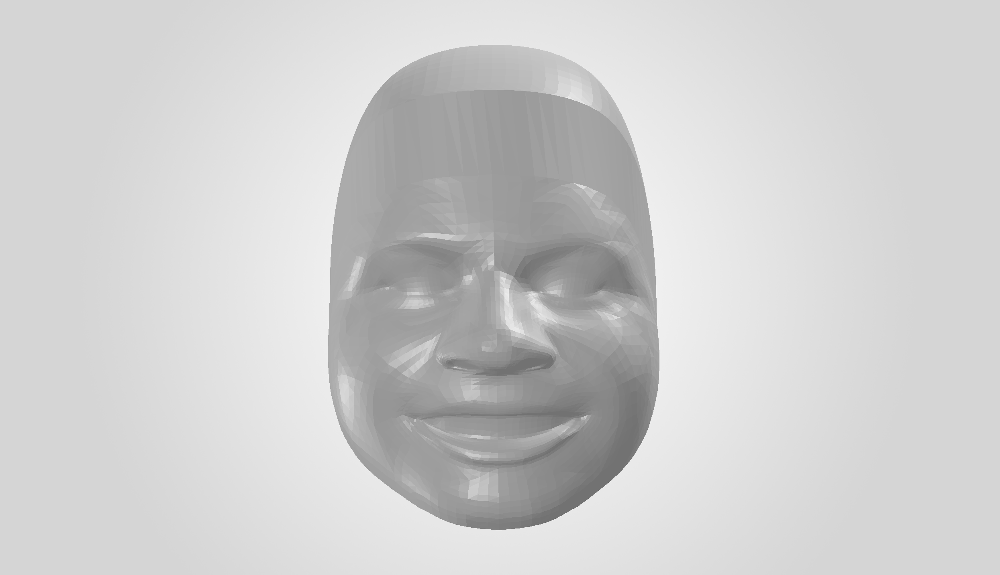
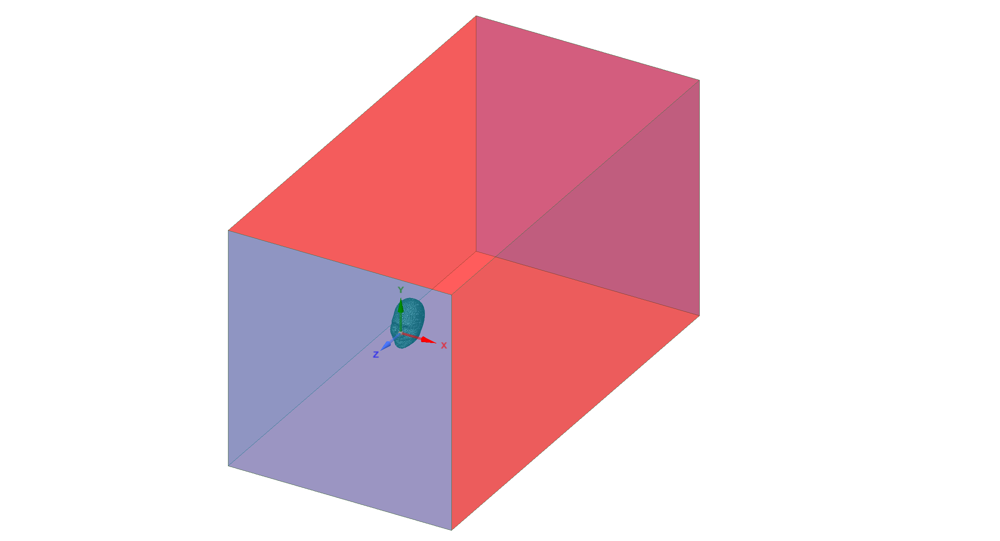
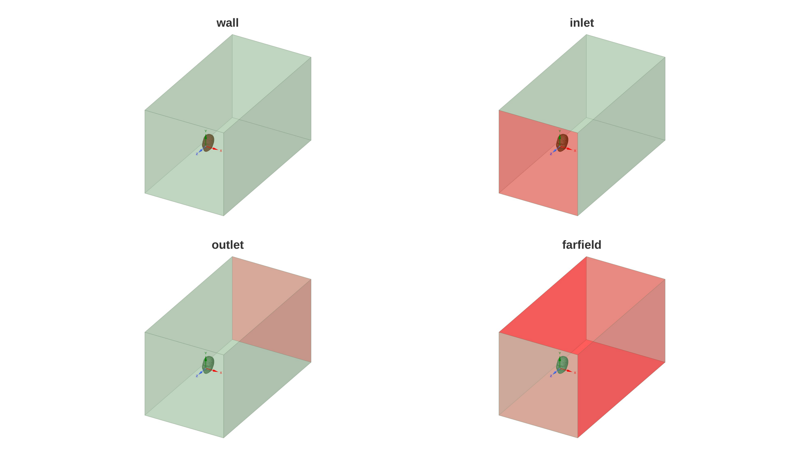
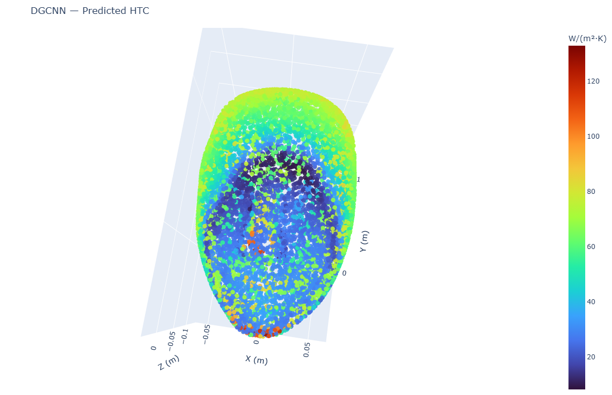
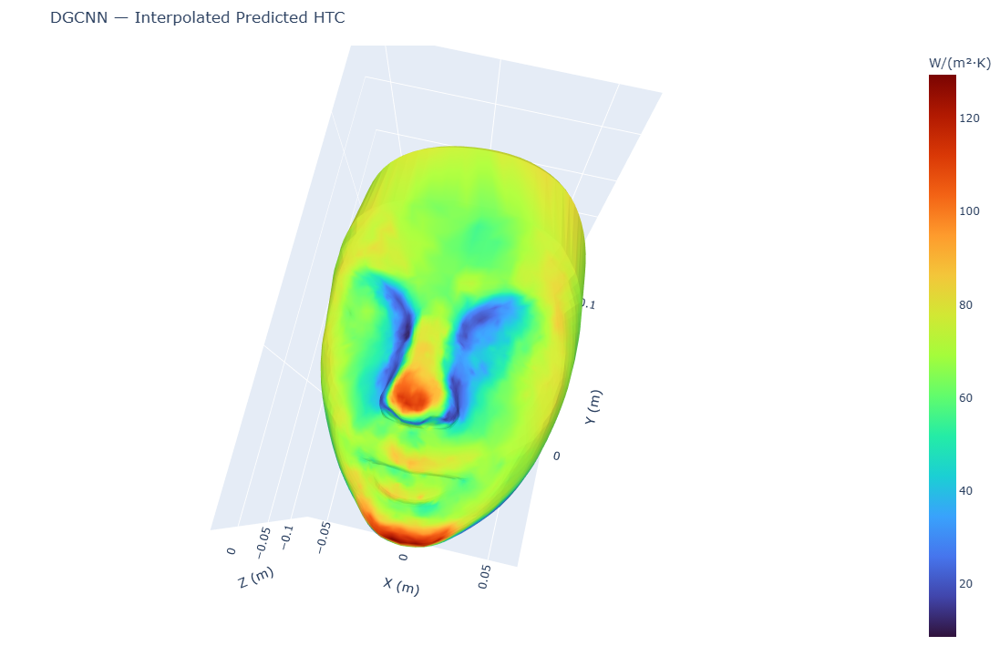
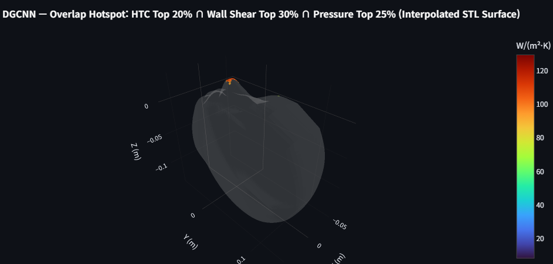

# AI-CFD Flow Prediction

End-to-end reconstruction and extension of an undergraduate AI-CFD project for predicting facial external-flow wall fields from 3D surface geometry and inlet velocity.

<p align="center">
  <a href="https://ai-cfd-flow-prediction-jtwnysikctniercmhrpfxj.streamlit.app/">
    
  </a>
</p>

<p align="center">
  <strong>Live App:</strong> Upload a face image, choose MLP or DGCNN and an inlet velocity, then run AI prediction and 3D visualization directly in your browser.
</p>

The current repository connects the full workflow:

```text
Face image
→ watertight 3D STL
→ SpaceClaim CFD geometry
→ Fluent CFD dataset
→ MLP / DGCNN surrogate training
→ new-image AI inference
→ 3D visualization and hotspot analysis
```

The surrogate models predict three wall quantities:

- **Heat-transfer coefficient (HTC)**
- **Wall shear**
- **Pressure**

from:

```text
[x, y, z, inlet velocity]
```

<p align="center">
  
</p>

---

## Project Overview

This repository was rebuilt to make the original project reproducible as a complete technical pipeline rather than only a collection of model-training scripts.

The final implementation includes:

- image-based 3D face reconstruction with metric scaling,
- watertight STL validation,
- automated SpaceClaim preprocessing,
- automated multi-speed ANSYS Fluent CFD,
- validation of a 300-case wall-field dataset,
- identity-level train/validation/test splitting,
- point-wise MLP and geometry-aware DGCNN surrogate models,
- three-target prediction of HTC, wall shear, and pressure,
- inference for previously unseen face images,
- raw and interpolated 3D field visualization,
- an interactive Streamlit interface with percentile and multi-field hotspot analysis.

The trained models are **CFD surrogates**: CFD-generated data are used for training, while a new-image inference run does not launch a new Fluent simulation.

---

## End-to-End Workflow

| Stage | Purpose | Main output |
|---|---|---|
| [`01_image_to_stl`](./01_image_to_stl/) | Reconstruct a metric-scaled watertight head from a frontal image | `.stl` |
| [`02_spaceclaim`](./02_spaceclaim/) | Create shrinkwrap, CFD enclosure, and Named Selections | `.scdoc` |
| [`03_fluent_cfd`](./03_fluent_cfd/) | Run automated CFD at 5, 8, and 10 m/s | CAS/DAT + wall CSV |
| [`04_cfd_dataset`](./04_cfd_dataset/) | Audit data, split by face identity, and prepare DGCNN FPS indices | validated ML dataset |
| [`05_model_training`](./05_model_training/) | Train and evaluate MLP and DGCNN surrogates | checkpoints + metrics |
| [`06_ai_prediction`](./06_ai_prediction/) | Reconstruct a new face and run trained-model inference | prediction CSV |
| [`07_visualization`](./07_visualization/) | Visualize fields and run interactive hotspot analysis | 3D plots + Streamlit UI |

The batch wrapper [`run_cfd_generation.py`](./run_cfd_generation.py) orchestrates **Stages 1–3** while preserving the individual stage scripts.

---

## 1. Image-Based Geometry Reconstruction

`01_image_to_stl/image_to_stl.py` converts a frontal face image into a closed, metric-scaled STL geometry.

The reconstruction uses:

- **MediaPipe Face Mesh** for facial landmarks,
- iris diameter as the metric-scale reference,
- front-face triangulation,
- mesh subdivision and HC Laplacian smoothing,
- synthetic back-head reconstruction,
- final `trimesh` validation.

The final STL is accepted only if it is:

```text
watertight
+ winding-consistent
+ a valid closed volume
```

The default iris reference diameter is **11.7 mm**, and the default maximum left/right iris mismatch is **25%**.

<table>
<tr>
<th>Input face image</th>
<th>Reconstructed STL</th>
</tr>
<tr>
<td align="center">
  
</td>
<td align="center">
  
</td>
</tr>
</table>

Detailed implementation: [`01_image_to_stl/README.md`](./01_image_to_stl/README.md)

---

## 2. SpaceClaim CFD Preprocessing

The watertight STL is converted into a CFD-ready SpaceClaim model by `02_spaceclaim/stl_to_scdoc.py`.

The automated sequence is:

```text
STL import
→ temporary solid
→ shrinkwrap
→ external-flow enclosure
→ enclosure solid
→ geometric boundary classification
→ Named Selections
→ SCDOC export
```

The final model creates:

```text
wall
inlet
outlet
farfield
```

without relying on fixed face IDs.

The standard shrinkwrap facet size is **5.0 mm**. A **4.0 mm** version is used only as the validated fallback for specific geometries that trigger Fluent Share Topology self-intersection.

<table>
<tr>
<th>CFD enclosure</th>
<th>Boundary Named Selections</th>
</tr>
<tr>
<td align="center">
  
</td>
<td align="center">
  
</td>
</tr>
</table>

Detailed implementation: [`02_spaceclaim/README.md`](./02_spaceclaim/README.md)

---

## 3. Automated Fluent CFD

`03_fluent_cfd/scdoc_to_cfd.py` reproduces the validated ANSYS Fluent workflow for each face geometry.

For every face:

```text
5 m/s
8 m/s
10 m/s
```

are simulated independently.

Each completed face produces:

```text
3 velocities × (CAS + DAT + CSV)
= 9 output files
```

### Main CFD configuration

| Item | Setting |
|---|---|
| ANSYS version | Fluent 2021 R1 / v211 |
| Solver | 3D double precision |
| Energy equation | ON |
| Turbulence model | SST k-ω |
| Volume mesh | Poly-Hexcore |
| Inlet velocity | 5 / 8 / 10 m/s |
| Inlet temperature | 268.15 K |
| Wall temperature | 307.15 K |
| Wall condition | No-slip |
| Initialization | Hybrid Initialization |
| Iterations | 100 per velocity |

The automation is based on a manually validated Fluent journal. Python handles runtime path substitution, orchestration, monitoring, diagnostics, and output validation, while the recorded journal preserves the validated Fluent setup.

The reference journal is intentionally retained at:

```text
03_fluent_cfd/fluent_cfd_workflow.jou
```

### Geometry-dependent robustness

Two important geometry-dependent failure modes were handled during reconstruction:

1. **Split wall zones after region update**  
   All Fluent zones carrying the SpaceClaim `wall` label are merged and validated instead of simply keeping the largest face zone.

2. **Share Topology self-intersection**  
   If the Fluent transcript detects the validated self-intersection failure, `scdoc_to_cfd.py` returns exit code `42`. The root wrapper then rebuilds only that face at **4 mm shrinkwrap** and retries Fluent once.

Detailed implementation and CFD settings: [`03_fluent_cfd/README.md`](./03_fluent_cfd/README.md)

---

## 4. CFD Dataset

The final CFD dataset contains:

```text
100 face geometries
× 3 inlet velocities
= 300 CFD cases
```

Each Fluent wall CSV contains:

```text
nodenumber
x-coordinate
y-coordinate
z-coordinate
pressure
temperature
y-plus
wall-shear
heat-flux
heat-transfer-coef
```

The learning task uses:

```text
Input  X = [x, y, z, velocity]
Target Y = [HTC, wall shear, pressure]
```

### Dataset audit

The final raw-data audit reported:

| Check | Result |
|---|---:|
| CFD CSV files | 300 |
| Unique faces | 100 |
| Complete 3-speed triplets | 100 |
| Total wall-data rows | 2,455,545 |
| Minimum rows / case | 7,127 |
| Maximum rows / case | 9,933 |
| Mean rows / case | 8,185.15 |
| Bad headers | 0 |
| Numeric parse errors | 0 |
| NaN values | 0 |
| Inf values | 0 |

One abnormal mesh was found during auditing: `face_0055` had only 2,704 wall nodes with the original 5 mm shrinkwrap. Rebuilding only that geometry at 4 mm produced **9,487 wall nodes** for each velocity case and removed the outlier.

### Face-level split

The split is performed by **face identity**, not by individual CFD file:

| Split | Face IDs | CFD cases |
|---|---|---:|
| Train | `face_0001` – `face_0080` | 240 |
| Validation | `face_0081` – `face_0090` | 30 |
| Test | `face_0091` – `face_0100` | 30 |

All three velocities for one face stay in the same split, preventing geometry leakage between training and evaluation.

### DGCNN point-cloud preprocessing

The original CFD wall meshes contain different numbers of nodes. DGCNN therefore uses deterministic **Farthest Point Sampling (FPS)**:

```text
7,127–9,933 CFD wall points
→ FPS
→ 7,000 points / case
```

The MLP does not require fixed-size point clouds and uses the available CFD wall points directly.

Detailed dataset pipeline: [`04_cfd_dataset/README.md`](./04_cfd_dataset/README.md)

---

## 5. Surrogate Models

Two neural-network approaches are implemented for the same three-target regression problem.

### Point-wise MLP

```text
[x, y, z, velocity]
        ↓
4 → 256 → 256 → 256 → 256 → 3
        ↓
[HTC, wall shear, pressure]
```

- independent regression at each surface point,
- 199,427 trainable parameters,
- all CFD wall points used,
- ReLU hidden activations,
- Adam optimizer and MSE loss.

Final training result:

```text
Best epoch    : 33
Best val loss : 0.12895100
```

### DGCNN

DGCNN represents each CFD case as a complete 7,000-point cloud and learns both local and global geometric information.

```text
7000 × [x, y, z, velocity]
        ↓
EdgeConv 1: 4 → 64
        ↓
EdgeConv 2: 64 → 64
        ↓
EdgeConv 3: 64 → 128
        ↓
local feature concatenation
        +
global max-pooled feature
        ↓
512 → 256 → 128 → 3
        ↓
7000 × [HTC, wall shear, pressure]
```

Key configuration:

```text
Trainable parameters : 189,955
k                    : 20
Points / case        : 7,000
First k-NN graph     : raw physical XYZ
```

Final training result:

```text
Best epoch    : 98
Best val loss : 0.04454750
```

Both final GPU runs were performed in **Google Colab with a Tesla T4**.

Detailed architectures and training workflows: [`05_model_training/README.md`](./05_model_training/README.md)

---

## Held-Out Test Results

The final evaluation uses the unseen face geometries:

```text
face_0091 – face_0100
× 5 / 8 / 10 m/s
= 30 held-out CFD cases
```

| Model | Target | Unit | MAE | RMSE | R² |
|---|---|---|---:|---:|---:|
| MLP | HTC | W/(m²·K) | 7.847612 | 12.157173 | 0.809757 |
| MLP | Wall shear | Pa | 0.065297 | 0.127328 | 0.844150 |
| MLP | Pressure | Pa | 3.928130 | 7.107886 | 0.944223 |
| **DGCNN** | **HTC** | W/(m²·K) | **5.489491** | **7.681516** | **0.919694** |
| **DGCNN** | **Wall shear** | Pa | **0.040926** | **0.068306** | **0.955010** |
| **DGCNN** | **Pressure** | Pa | **3.417522** | **5.796989** | **0.961108** |

Under this dataset and face-level split, DGCNN produced lower MAE/RMSE and higher R² for all three targets.

The evaluation point sets are not identical:

```text
MLP   : 244,296 held-out wall points
DGCNN : 30 cases × 7,000 FPS points = 210,000 points
```

The result should therefore be interpreted as a **project-level surrogate-model comparison**, not as a strict architecture-only ablation.

---

## 6. New-Image AI Inference

After training, a new face can be processed without launching Fluent.

The inference sequence is:

```text
new face image
→ reconstructed STL
→ deterministic surface sampling
→ model-specific point cloud
→ append inlet velocity
→ trained surrogate
→ predicted HTC / wall shear / pressure
```

A common **10,000-point** STL surface sample is generated first.

```text
MLP
→ all 10,000 sampled points

DGCNN
→ FPS: 10,000 → 7,000 points
```

Both models write the same output schema:

```text
x,y,z,velocity,predicted_htc,predicted_wall_shear,predicted_pressure
```

Coordinate units are converted from STL millimeters to **meters** before inference, matching the training convention.

Detailed inference pipeline: [`06_ai_prediction/README.md`](./06_ai_prediction/README.md)

---

## 7. 3D Visualization

Three visualization layers are implemented:

```text
raw prediction points
→ interpolated STL surface
→ interactive hotspot analysis
```

### Raw prediction and interpolated surface

`3d_plot.py` visualizes the model output directly at prediction points.

`interpolation.py` maps the prediction values back onto the reconstructed STL vertices using inverse-distance weighting:

```text
neighbors = 8
power     = 2
```

<table>
<tr>
<th>Raw prediction points</th>
<th>Interpolated STL surface</th>
</tr>
<tr>
<td align="center">
  
</td>
<td align="center">
  
</td>
</tr>
</table>

Interactive Plotly examples are also included:

- [`raw_prediction_3d.html`](./07_visualization/assets/raw_prediction_3d.html)
- [`interpolated_surface.html`](./07_visualization/assets/interpolated_surface.html)

---

## 8. Interactive Streamlit App

### Launch the live app

[](https://ai-cfd-flow-prediction-jtwnysikctniercmhrpfxj.streamlit.app/)

No local installation is required for the hosted app. Upload a face image, select the model and inlet velocity, and click **Run Prediction**.

`07_visualization/streamlit_app.py` combines new-image inference and visualization into one interface:

```text
upload image
→ choose MLP / DGCNN
→ choose inlet velocity
→ Run Prediction
→ inspect predicted 3D wall fields
```

The app supports:

- raw prediction points,
- interpolated STL surfaces,
- HTC / wall shear / pressure selection,
- full-field display,
- Top-X% filtering,
- independent percentile thresholds,
- overlap analysis between any two or all three fields,
- field statistics and interpolation diagnostics.

For example, the overlap mode can display:

```text
HTC Top 20%
AND
Wall Shear Top 10%
AND
Pressure Top 30%
```

<p align="center">
  
</p>

Detailed visualization documentation: [`07_visualization/README.md`](./07_visualization/README.md)

---

## Repository Structure

```text
ai-cfd-flow-prediction/
├── 01_image_to_stl/
│   ├── image_to_stl.py
│   ├── README.md
│   └── example geometry assets
│
├── 02_spaceclaim/
│   ├── stl_to_scdoc.py
│   ├── README.md
│   └── SpaceClaim example assets
│
├── 03_fluent_cfd/
│   ├── scdoc_to_cfd.py
│   ├── fluent_cfd_workflow.jou
│   └── README.md
│
├── 04_cfd_dataset/
│   ├── audit_dataset.py
│   ├── preprocessing_dgcnn.py
│   ├── dataset.py
│   ├── fps_indices_7000.npz
│   └── README.md
│
├── 05_model_training/
│   ├── common/
│   ├── mlp/
│   ├── dgcnn/
│   ├── notebooks/
│   ├── results/
│   ├── weights/
│   └── README.md
│
├── 06_ai_prediction/
│   ├── preprocess.py
│   ├── mlp/
│   ├── dgcnn/
│   ├── assets/
│   └── README.md
│
├── 07_visualization/
│   ├── 3d_plot.py
│   ├── interpolation.py
│   ├── streamlit_app.py
│   ├── assets/
│   └── README.md
│
├── project_paths.py
├── run_cfd_generation.py
├── requirements.txt
└── README.md
```

---

## Installation

### Python dependencies

```powershell
git clone https://github.com/hehong01/ai-cfd-flow-prediction.git
cd ai-cfd-flow-prediction

pip install -r requirements.txt
```

The direct Python dependencies are:

```text
numpy
pandas
scipy
torch
opencv-python
mediapipe
trimesh
plotly
streamlit
```

### ANSYS dependency

The geometry-to-CFD automation was reconstructed and validated with:

```text
ANSYS SpaceClaim 2021 R1 / v211
ANSYS Fluent 2021 R1 / v211
Windows
```

ANSYS is an external licensed application and is **not** installed through `requirements.txt`.

The pretrained-model inference and visualization stages do not run Fluent.

---

## Local Data Layout

Generated data are kept outside the Git repository.

By default, `project_paths.py` uses:

```text
../ai-cfd-data
```

relative to the repository root.

A typical layout is:

```text
workspace/
├── ai-cfd-flow-prediction/
│   └── ...
│
└── ai-cfd-data/
    ├── 01_images/
    ├── 02_stl/
    ├── 03_spaceclaim/
    ├── 04_fluent/
    ├── 05_cfd_csv/
    ├── 07_predictions/
    └── 08_results/
```

To use a different location in PowerShell:

```powershell
$env:AI_CFD_DATA_ROOT = "D:\path\to\ai-cfd-data"
```

---

## Running the Project

### A. Generate geometry and CFD data

Stages 1–3 can be run with the root wrapper:

```powershell
python .\run_cfd_generation.py
```

This performs:

```text
image → STL
→ SpaceClaim SCDOC
→ Fluent 5 / 8 / 10 m/s CFD
```

The wrapper is resume-friendly: completed outputs are detected and skipped, while the validated 4 mm fallback is applied only when the specific Fluent self-intersection condition is detected.

### B. Validate and prepare the dataset

```powershell
python .\04_cfd_dataset\audit_dataset.py
python .\04_cfd_dataset\preprocessing_dgcnn.py --num-points 7000
python .\04_cfd_dataset\dataset.py
```

### C. Train / evaluate the MLP

```powershell
python .\05_model_training\mlp\model.py
python .\05_model_training\mlp\train.py
python .\05_model_training\mlp\evaluate.py
```

### D. Train / evaluate the DGCNN

```powershell
python .\05_model_training\dgcnn\model.py
python .\05_model_training\dgcnn\train.py
python .\05_model_training\dgcnn\evaluate.py
```

The executed final GPU workflows are also available in:

```text
05_model_training/notebooks/
├── ai_cfd_mlp_colab.ipynb
└── ai_cfd_dgcnn_colab.ipynb
```

### E. Launch the interactive prediction app

**Hosted app — one click:**

[](https://ai-cfd-flow-prediction-jtwnysikctniercmhrpfxj.streamlit.app/)

**Run locally from the repository root:**

```powershell
python -m streamlit run .\07_visualization\streamlit_app.py
```

The app uses the trained checkpoints under `05_model_training/weights/` and performs new-image reconstruction, preprocessing, AI inference, and visualization.

---

## Reproducibility and Scope

A few details are important when interpreting the project:

- **CFD is the training-data source.** The neural networks approximate the learned CFD mapping; they are not standalone physics solvers.
- **New-image inference does not use Fluent.** Once trained, the surrogate predicts the three wall fields from reconstructed surface geometry and inlet velocity.
- **Training and new-image point distributions differ.** Training data come from Fluent wall-surface nodes, while inference uses points sampled from reconstructed STL surfaces.
- **MLP and DGCNN evaluation point sets differ.** MLP uses all held-out wall nodes; DGCNN uses 7,000 FPS points per case.
- **Large generated CFD files are kept outside Git.** CAS/DAT/CSV data are generated locally through the CFD pipeline.
- **The 4 mm shrinkwrap is a targeted fallback, not the default.** The standard preprocessing resolution remains 5 mm.

---

## Detailed Documentation

Each stage contains its own README with the implementation details, validation logic, commands, and technical decisions:

1. [`01_image_to_stl/README.md`](./01_image_to_stl/README.md)
2. [`02_spaceclaim/README.md`](./02_spaceclaim/README.md)
3. [`03_fluent_cfd/README.md`](./03_fluent_cfd/README.md)
4. [`04_cfd_dataset/README.md`](./04_cfd_dataset/README.md)
5. [`05_model_training/README.md`](./05_model_training/README.md)
6. [`06_ai_prediction/README.md`](./06_ai_prediction/README.md)
7. [`07_visualization/README.md`](./07_visualization/README.md)

---

## Project Status

All seven stages are implemented and connected:

```text
geometry reconstruction      ✓
SpaceClaim preprocessing     ✓
Fluent CFD automation        ✓
dataset validation           ✓
MLP / DGCNN training         ✓
new-image AI inference       ✓
3D / Streamlit visualization ✓
```

The repository therefore represents a complete AI-CFD workflow from **face image → CFD-generated training data → trained surrogate → interactive prediction visualization**.
